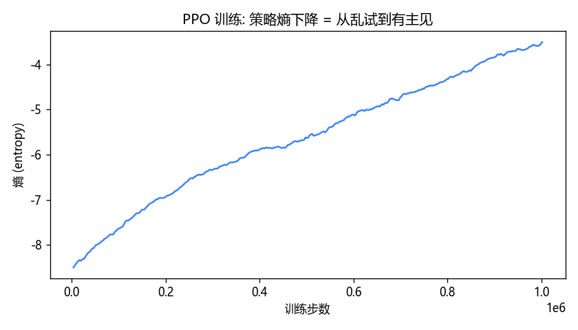
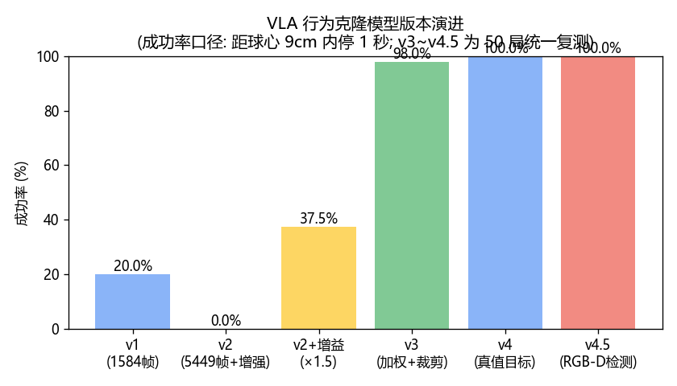
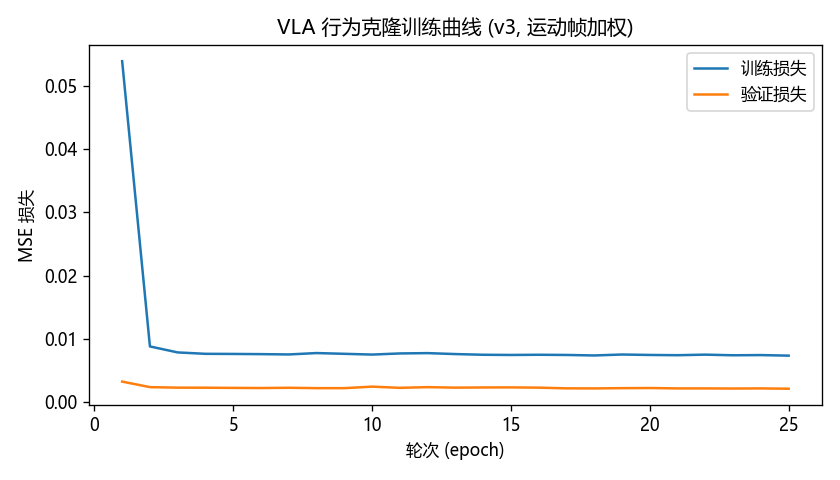
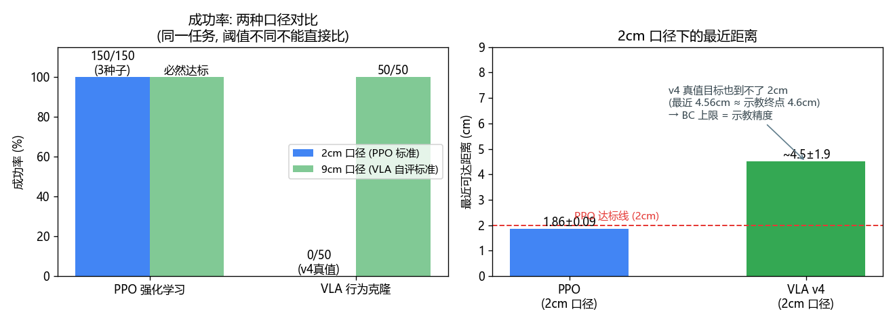

# 实验报告: 六轴机械臂 UR5e 控制栈 (MuJoCo)

> 作者: 王智伟 (Wang Zhiwei) · 广东工业大学 机械设计制造及其自动化 (2022 级) · 2791842174@qq.com   日期: 2026-09
> 项目仓库: https://github.com/wang-robotics/ur5e-control-stack
> 实验环境: MuJoCo 3.9 + Python 3.10, 单机 RTX 3060 Laptop / CPU 训练

## 1. 实验一: 强化学习 (PPO) 训练末端速度控制策略

- 任务: Reach —— 末端到达随机目标点 (2cm 内成功)
- 环境: UR5eReachEnv, 动作 = 6 维末端速度 (OSC 映射), 观测 21 维
- 训练: PPO, 1M 步 × 3 种子, ~30 分钟 CPU / 种子
- **结果: 成功率 150/150 (100.0% ± 0.0%, 2cm 口径, 50 局 × 3 种子), 最终距离 1.86±0.09cm**

*解读: 熵 (策略随机性) 随训练下降 = 策略从"乱试"收敛到"有主见"。*

## 2. 实验二: VLA 行为克隆 (图像 -> 动作)

- 数据: 键盘遥操作采集 24 条示教 (~3 分钟人工操作, 其中 14 条自动保存、终点 <9cm), 预处理后 4703 帧
- 模型: 轻量 CNN (224x224 图像 -> 6 维末端速度), MSE 行为克隆
- 部署: 模型输出 -> 增益 x1.5 -> OSC -> 仿真闭环

### 版本演进

| 版本 | 改动 | 成功率 (9cm 口径) |
|---|---|---|
| v1 | 1584 帧, 基础训练 | 1/5 (20%) |
| v2 | 5449 帧 + 数据增强 | 0/10 (停在半路) |
| v2+增益 | 诊断"回归到均值", 输出 x1.5 | 3/8 (37.5%) |
| v3 | 发呆帧裁剪 + 运动帧 3 倍加权 | 49/50 (98%, 复现重训) |
| v4 | 目标条件输入 (图像 + 真值坐标) | 50/50 (100%) |
| **v4.5** | **目标条件 + RGB-D 实时检测 (修复版, 误差 ~5cm)** | **50/50 (100%)** |

> 口径说明: VLA 的"成功"= 距球心 9cm 内停 1 秒 (与遥操作示教的自评标准一致)。
> PPO 的成功口径是 2cm —— 两者阈值不同, 数字不可直接对比 (见第 3 节)。
> v1~v2+增益为历史小样本记录 (5~10 局); v3~v4.5 为 2026-09-06 统一 50 局协议复测
> (v3 权重曾被覆盖, 按原配方复现重训; 原记录 14/20 (70%) 是小样本噪声)。
> v4.5 的检测器在复测中发现两个 bug (min 选取被边缘像素劫持 + 检测失败静默回退真值),
> 已修复为"红像素质心 + 中位深度 + 中性回退", 上表为修复版成绩。

*关键诊断: 行为克隆的"回归到均值"——数据中发呆帧偏多导致模型输出偏小、
提前停车; 运动帧加权 + 输出增益是有效解药。架构演进: 端到端看图 (v3)
→ 目标条件 (v4) → 感知+策略完整系统 (v4.5)。*

## 3. 两种学习范式对比 (核心结论)

| | PPO 强化学习 | VLA 行为克隆 |
|---|---|---|
| 学习方式 | 试错 (奖励驱动) | 模仿 (示范驱动) |
| 训练代价 | 100 万步 × 3 种子 | ~3 分钟人工示教 |
| 成功率 (2cm 口径) | 150/150 (100%, 3 种子) | **0~10% (三次训练: 0/50、5/50、0/50; 换真值/换检测器不变)** |
| 成功率 (9cm 口径) | 必然达标 | 50/50 (v4 与 v4.5 修复版相同) |
| 最近可达距离 (2cm 口径) | 1.86±0.09cm | 4.56±1.93cm (v4 真值) |
| 输入 | 21 维状态 | 相机图像 + RGB-D 检测目标 |
| 适用场景 | 奖励好定义的精确控制 | 有示教、需要视觉/泛化的任务 |

**结论: 同一任务可用两种范式解决, 但必须分口径表述。PPO 在 2cm 标准下
150/150 (50 局×3 种子, 最终距离 1.86±0.09cm); VLA 在 9cm 标准下 50/50,
在 2cm 标准下成功率 0~10% (三次训练: 0/50、5/50、0/50) —— 且**换真值目标 (v4)
或换修复版检测器 (v4.5) 结果一样** (两者 50 局的最终距离分布几乎重合)。
严格证据是同类指标对照: 遥操作示教约 10% 回合 (2/24) 终止 <2cm, 策略在同阈值下
的成功率 0~10% —— 策略复现了示教的分布; 示教终点距离 4.6±2.4cm 与策略最近距离
4.56±1.93cm 同量级 (两者指标不同义, 仅作量级参照)。行为克隆的精度上限 =
示教精度, 换目标来源救不了它。RGB-D 检测器 (修复版误差 ~5cm, 开局覆盖率 82%)
在 2cm 紧公差下只是第二层噪声。这恰是行为克隆的已知局限: 策略性能受示教质量
约束, 而强化学习是模型法 (动力学已知), 可直接优化到任意阈值。完整系统由
RGB-D 感知模块与目标条件策略网络组成, 具备接入视觉-语言指令 (VLA 路线)
的扩展能力。**

**附注 (数据清洗对照实验)**: 曾怀疑训练集混入的 10 条未对准示教拖累精度,
做了受控对照 (同配方, 干净 14 条 vs 全部 24 条): 干净模型 @2cm 反而 0/50
(最近 3.92cm), 脏基线重训 5/50 (最近 2.71cm)。结论: 未对准示教的运动片段
仍有价值, "发呆裁剪 + 运动帧加权"已能消化数据不平衡, 无需清洗。
VLA 偶尔进 2cm 的比例 (~10%) 与示教中终点 <2cm 的占比一致 —— 上限由示教分布决定。

## 4. 附: 运动学层实验 (W2)

- 奇异位形脱困: 折叠点是不稳定平衡, 任意扰动最终脱困 (无最小甩力, 只有起飞时间)
- DLS 阻尼扫掠: λ 越大解越软越慢, 甜蜜点 0.05 (0.01 打滑 / 0.5 爬行)
- 详见 docs/IK推导笔记.md
